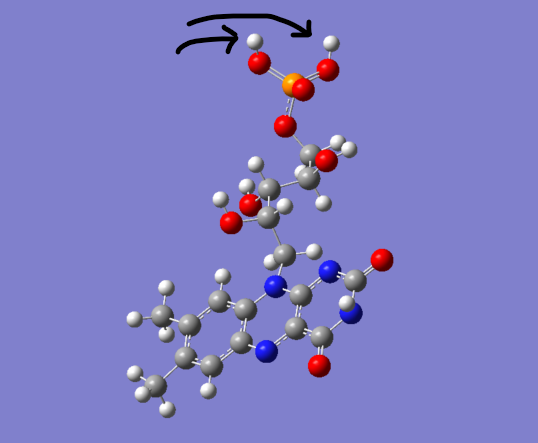

# Log

## Gaussian Input Files

|gjf id|Name|Methods|Detail|
|---|---|---|---|
|0|raw_FMN.gjf|*|raw file that gaussview output|
|1|HF_dp_1.gjf|HF/6-31(d,p)|The first step to optimize structure.|
|2|B3LYP_dp_1.gjf|B3LYP/6-31(d,p) pop=(mk,saveesp)|The second step to optimize structure more acculately and obtain ESP charge in chk file|
|3|B3LYP_dp_2.gjf|B3LYP/6-31(d,p) iop=(6/42=6,6/50=1) pop=(mk)|The third step only to obtain ESP charge as a single file for antechamber|
|4|B3LYP_dp_3.gjf|b3lyp/6-31g(d,p) pop=(nbo,savenbo)|The forth step only to obtain bond order|
|5|HF_dp_2.gjf|opt HF/6-31g(d,p)|Recalculation by adding two hydrogens to oxygens of phosphoric acid group|
|6|B3LYP_dp_4.gjf|opt b3lyp/6-31g(d,p) pop=(mk,saveesp)||
|7|B3LYP_dp_5.gjf|b3lyp/6-31g(d,p) pop=mk iop(6/42=6,6/50=1)||
|8|B3LYP_dp_6.gjf|opt B3LYP/6-31g(d,p) pop=(mk,saveesp)|Use only B3LYP, without HF|

## Process

### Oxydized phosphoric acid

1. Pick up FMN coordinates from [2PR5.pdb](https://www.rcsb.org/structure/2PR5) and save as `FMN.pdb`.
2. Input `FMN.pdb` to gaussview 6.0.16 and create gjf file that is gjf id 0, `raw_FMN.gjf` file.
3. Copy `raw_FMN.gjf` to `HF_dp_1.gjf` and modify it. gjf id is 1. 
4. Copy `HF_dp_1.gjf` to `B3LYP_dp_1.gjf` and remove all coodinates. gjf id is 2.
5. Copy `B3LYP_dp_1.gjf` to `B3LYP_dp_2.gjf` and modify header and add file name in the bottom of file. gjf id is 3.
6. Run `Gaussian 16:  ES64L-G16RevC.01` using `scripts/job.sh`
7. Add `B3LYP_dp_3.gjf` to calculate bond order. Modify `scripts/job.sh` and run.

### Reduced phosphoric acid

These jobs were preformed in IMS. 

1. Using `Oxydized phosphoric acid` step1's `FMN.pdb`, Add two hydrogens to phosphoric acid group. Obtain `raw_FMN_added_hydrogen.gjf`.

2. Copy `raw_FMN_added_hydrogen.gjf` to `HF_dp_2.gjf` and modify. The modification is same as `HF_dp_1.gjf`.
3. Do same processes of `B3LYP_dp_1.gjf` and `B3LYP_dp_2.gjf` and save them as `B3LYP_dp_4.gjf` and `B3LYP_dp_5.gjf`, respectively.
4. Run.

### Use B3LYP in entire job.

1. Copy `HF_dp_2.gjf` as `B3LYP_dp_6.gjf`, change method(HF -> B3LYP), and add `pop=(mk,saveesp)`
2. Run `B3LYP_dp_6.gjf` and `B3LYP_dp_5.gjf` to obtain ESP charge as a separated file.
